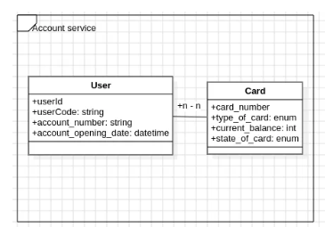

# Account Service

# Thiết kế cơ sở dữ liệu cho Account Service bao gồm các bảng chính sau:

- Bảng user sẽ liên kết 1 nhiều đến bảng card.

Service này sử dụng keycloak để phân quyền nguời dùng có thể truy cập vào các chức năng của hệ thống. Các chức năng chính của Account Service bao gồm:
- Admin:
  + Thêm mới người dùng (Lưu thông tin người dùng vào bảng user và gọi api đến keycloak để taọ người dùng trên keycloak)
  + Mở thẻ mới (lưu thông tin thẻ và gọi qua kafka để cập nhật số dư mới cho card service)
