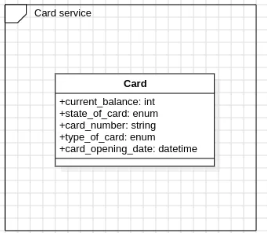

# Card service

- Đây là thiết kế cơ sở dữ liệu của service gồm 1 bảng duy nhất

- service này sử dụng cqrs pattern và handler để triển khai command ghi dữ liệu (khi ghi sẽ gửi message thông tin thẻ thay đổi đến kafka)