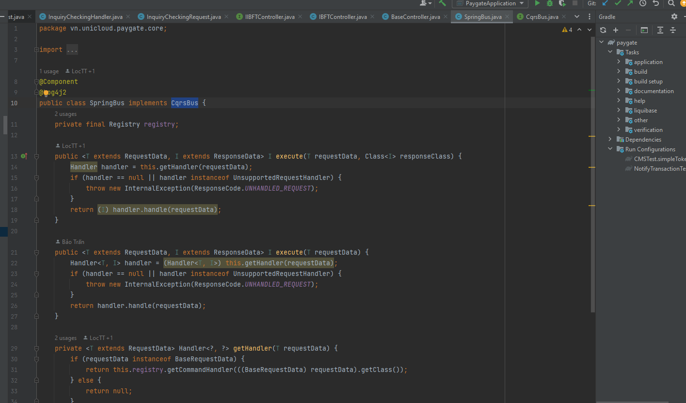

1. Tạo thư viện CQRS core (shared-lib)
Ví dụ folder: cqrs-core

✨ Các thành phần nên có:
Thành phần	Mục đích
Command, Query, Request, Response	Giao diện đánh dấu (marker interface)
CommandHandler<TCommand, TResponse>	Interface xử lý ghi
QueryHandler<TQuery, TResponse>	Interface xử lý đọc
Mediator (interface) & ConcreteMediator	Trung gian điều phối
HandlerRegistry (hoặc dùng Spring context để tự động map)	Định tuyến request đến đúng handler

đây là ví dụ triển khai mediator pattern để tìm đến đúng handler 
